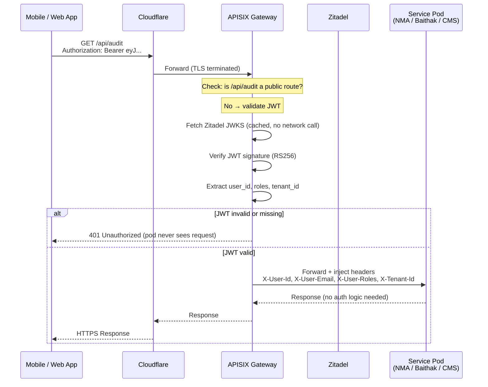

# infra-gateway

> **One gateway. Multiple projects.**  
> Centralised API Gateway and Identity Provider for all sfg-labs services.

[](https://k3s.io)
[](https://apisix.apache.org)
[](https://zitadel.com)
[](https://github.com/sfg-labs/infra-gateway/actions/workflows/ci.yml)

Built on **Apache APISIX** + **Zitadel**, deployed on **k3s** on Cantech Mumbai DC.  
Every external API call for **NMA India**, **Baithak**, and **CMS** flows through this gateway.  
Your services receive validated user context via HTTP headers — **zero auth code needed in your service**.

**GitHub:** [sfg-labs/infra-gateway](https://github.com/sfg-labs/infra-gateway)

---

## How an API call travels end to end

This is the exact path of every request — from a phone app to a pod and back.

```
INTERNET
   │
   │  HTTPS (TLS 1.3)  ← encrypted by Cloudflare certificate
   ▼
┌─────────────┐
│ Cloudflare  │  DDoS protection, DNS, TLS termination
└──────┬──────┘
       │  HTTP (private Cloudflare → server tunnel)
       ▼
┌─────────────────────────────────────────────────────┐
│  k3s Cluster (Cantech Mumbai DC)                    │
│                                                     │
│  ┌──────────────────────────────────────────────┐   │
│  │  APISIX Pod (worker-01 or worker-02)         │   │
│  │                                              │   │
│  │  1. Is this a public route? (/health etc.)   │   │
│  │     YES → forward directly to pod            │   │
│  │     NO  → check Authorization header         │   │
│  │                                              │   │
│  │  2. JWT present?                             │   │
│  │     NO  → return 401 immediately             │   │
│  │     YES → validate signature (local JWKS)   │   │
│  │                                              │   │
│  │  3. JWT valid?                               │   │
│  │     NO  → return 401                         │   │
│  │     YES → inject headers, forward to pod     │   │
│  └──────────────────────────────────────────────┘   │
│              │ WireGuard encrypted (inter-node)      │
│              ▼                                       │
│  ┌───────────────────────┐                          │
│  │  Your Service Pod     │                          │
│  │  (NMA / Baithak / CMS)│                          │
│  │                       │                          │
│  │  Receives headers:    │                          │
│  │  X-User-Id            │                          │
│  │  X-User-Email         │                          │
│  │  X-User-Roles         │                          │
│  │  X-Tenant-Id          │                          │
│  └───────────────────────┘                          │
└─────────────────────────────────────────────────────┘
```

---

## How Auth Works (step by step)

### Step 1 — Login (done once, gets you a token)

```
Mobile App / Web
      │
      │  POST https://auth.sfg-labs.in/v1/users/me/login
      │  { "email": "user@example.com", "password": "..." }
      │
      ▼
   Zitadel (auth server)
      │
      │  Returns:
      │  { "access_token": "eyJ...", "expires_in": 3600 }
      │
      ▼
   App stores token locally
```

### Step 2 — Every API call after login



### Step 3 — Token refresh (automatic, app handles this)

```
Token expires after 1 hour.
App calls POST /auth/v1/oidc/token with refresh_token → gets new access_token.
No re-login needed for the user.
```

---

## Security: How payloads are protected

Every request is protected by **two independent encryption layers**:

```
┌─────────────────────────────────────────────────────────────────┐
│  LAYER 1: Cloudflare TLS (Internet traffic)                     │
│                                                                  │
│  Internet ──[TLS 1.3 encrypted]──► Cloudflare ──► k3s cluster  │
│                                                                  │
│  • Certificate issued by Cloudflare                             │
│  • All data encrypted in transit — no one can read or modify    │
│  • Cloudflare blocks DDoS before it reaches your servers        │
└─────────────────────────────────────────────────────────────────┘

┌─────────────────────────────────────────────────────────────────┐
│  LAYER 2: WireGuard (Inside the cluster, pod to pod)           │
│                                                                  │
│  APISIX Pod ──[WireGuard encrypted]──► Service Pod              │
│                                                                  │
│  • k3s uses WireGuard as its network overlay                    │
│  • All traffic between nodes (worker-01 ↔ worker-02) is        │
│    encrypted at the kernel level — no application change needed  │
│  • Even if someone has access to the server's network cable,    │
│    they cannot read pod-to-pod traffic                          │
└─────────────────────────────────────────────────────────────────┘

┌─────────────────────────────────────────────────────────────────┐
│  LAYER 3: JWT Signature Verification (Auth integrity)           │
│                                                                  │
│  • Every JWT is signed by Zitadel using RS256 (private key)    │
│  • APISIX verifies the signature using the public key only      │
│  • Tampering with the JWT payload = signature mismatch = 401   │
│  • Private key never leaves Zitadel                             │
└─────────────────────────────────────────────────────────────────┘
```

### What this means in practice

| Attack | Protected by | Result |
|--------|-------------|--------|
| Sniff traffic on the internet | Cloudflare TLS | Encrypted, unreadable |
| Sniff traffic between cluster nodes | WireGuard | Encrypted, unreadable |
| Forge a JWT token | RS256 signature | Invalid signature → 401 |
| Tamper with JWT payload | RS256 signature | Signature mismatch → 401 |
| Call API without a token | APISIX auth check | 401 before pod sees it |
| Replay an expired token | JWT `exp` claim check | 401 |
| DDoS the server | Cloudflare | Blocked at edge |

---

## How to connect your service

### For backend teams — 3 steps

**Step 1:** Make sure your service is running as a K8s `Service` in `sfg-apps` namespace:
```yaml
apiVersion: v1
kind: Service
metadata:
  name: my-service       # ← remember this name
  namespace: sfg-apps
spec:
  selector:
    app: my-service
  ports:
    - port: 3000
```

**Step 2:** Create `routes/my-service.yaml` in this repo:
```yaml
apiVersion: apisix.apache.org/v2
kind: ApisixRoute
metadata:
  name: my-service
  namespace: sfg-gateway
spec:
  http:
  - name: my-service-api
    match:
      hosts:
      - api.my-domain.com
      paths:
      - /api/*
    backends:
    - serviceName: my-service      # must match Step 1
      serviceNamespace: sfg-apps
      servicePort: 3000
    plugins:
    - name: openid-connect
      enable: true
      config:
        discovery: https://auth.sfg-labs.in/.well-known/openid-configuration
        bearer_only: true
        set_userinfo_header: true
        userinfo_header_name: X-Userinfo
```

**Step 3:** Open a PR. Gateway picks it up automatically on merge — no restart, no manual apply.

See [docs/adding-a-service.md](docs/adding-a-service.md) for the full guide.

---

## Headers your service receives (already validated)

```
X-User-Id      → usr_abc123           Zitadel user ID
X-User-Email   → user@example.com     User email
X-User-Roles   → admin,auditor        Comma-separated roles
X-Tenant-Id    → tenant_xyz           Multi-tenant ID
X-Userinfo     → eyJ...               Base64 full OIDC info
X-Request-Id   → req_abc123           Unique request trace ID
X-Gateway      → sfg-labs             Confirms passed through gateway
```

**Your service never needs to validate tokens.** If a request arrives at your pod with these headers, it has already been verified.

---

## Services routed

| Project | External Host | Pod | Port | Auth |
|---------|---------------|-----|------|------|
| NMA India | `api.nma-india.in` | `nma-india-engine` | 3000 | JWT |
| Baithak | `api.baithak.live` | `baithak-api` | 8000 | JWT |
| CMS | `api.cms.sfg-labs.in` | `cms-api` | 8001 | JWT |
| Auth | `auth.sfg-labs.in` | `zitadel` | 8080 | Public |

---

## Infrastructure

| VM | Spec | Role | Cost |
|----|------|------|------|
| k3s-master | 4c / 8 GB | Control plane | ₹1,500/mo |
| worker-01 | 4c / 8 GB | APISIX + Zitadel + NMA | ₹1,500/mo |
| worker-02 | 4c / 8 GB | APISIX + Baithak + CMS | ₹1,500/mo |
| db-01 | 4c / 16 GB | Postgres (outside K8s) | ₹2,800/mo |
| ops-01 | 2c / 4 GB | Grafana + Prometheus + Loki | ₹800/mo |
| **Total** | | **Gateway runs as pods — no extra cost** | **₹8,100/mo** |

---

## Quick Start (DevOps)

### Prerequisites
- 3 Cantech VMs provisioned
- `db-01` Postgres with `zitadel` database created
- `kubectl` + `helm` + `docker` installed locally

### 1. Provision k3s cluster
```bash
# On k3s-master VM
bash k3s/install-master.sh
# Copy the NODE_TOKEN printed at the end

# On worker-01 and worker-02
bash k3s/install-worker.sh <MASTER_PRIVATE_IP> <NODE_TOKEN>
```

### 2. Pull kubeconfig
```bash
bash k3s/kubeconfig.sh <MASTER_PUBLIC_IP>
kubectl get nodes  # 3 nodes = Ready
```

### 3. Deploy
```bash
bash helm/deploy.sh
kubectl apply -f routes/
```

### 4. Test locally with Docker (before touching any VM)
```bash
docker compose up -d
bash docker/apisix/setup-routes.sh
bash tests/smoke/smoke-test-local.sh
```

---

## Running Tests

```bash
bash tests/validate-routes.sh      # route YAML schema check
bash tests/lint.sh                 # yamllint + shellcheck
bash tests/helm-template.sh        # Helm dry-run (no cluster needed)
bash tests/smoke/smoke-test-local.sh   # Docker stack smoke tests
bash tests/smoke/smoke-test.sh https://api.nma-india.in  # live
```

---

## Folder Structure

```
infra-gateway/
├── k3s/               k3s cluster setup scripts
├── helm/              Helm values — APISIX + Zitadel
├── routes/            ApisixRoute CRDs per service
├── docker/            Local test stack (Docker Compose config + route setup)
├── tests/             Lint, Helm dry-run, smoke tests
└── docs/              Guide for service owners
```

---

## Created By

**Faith & Gamble IT** · Ashish Sharma  
[sfg-labs](https://github.com/sfg-labs) · Mumbai, India · 2026

> *One gateway. Multiple projects.*
