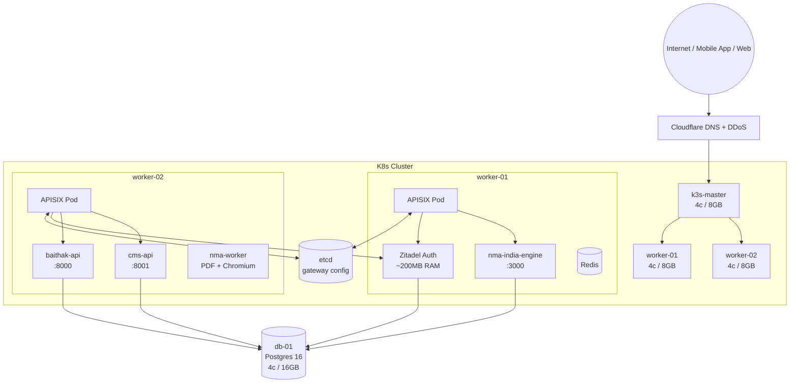
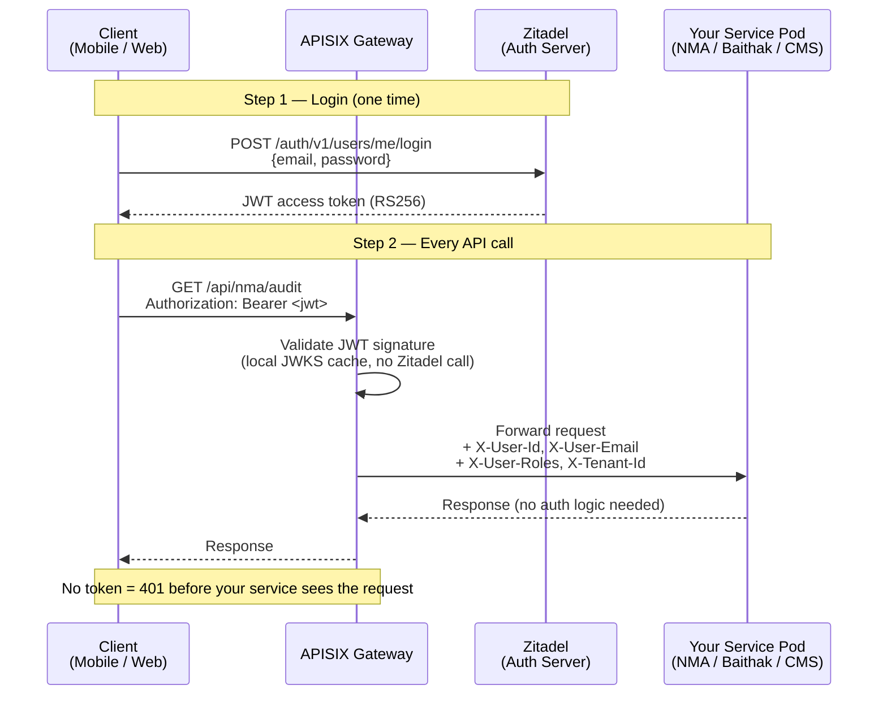

# infra-gateway

> **One gateway. Multiple projects.**  
> Centralised API Gateway and Identity Provider for all sfg-labs services.

[](https://k3s.io)
[](https://apisix.apache.org)
[](https://zitadel.com)
[](LICENSE)

Built on **Apache APISIX** + **Zitadel**, deployed on **k3s** on Cantech Mumbai DC.

Every external API call for **NMA India**, **Baithak**, and **CMS** flows through this gateway.  
Your services receive validated user context via HTTP headers — **zero auth code needed in your service**.

---

## Architecture



---

## Auth Flow



---

## Services Routed

| Project | External Host | Upstream Pod | Port | Auth |
|---------|---------------|--------------|------|------|
| NMA India | `api.nma-india.in` | `nma-india-engine` | 3000 | JWT (Zitadel) |
| Baithak | `api.baithak.live` | `baithak-api` | 8000 | JWT (Zitadel) |
| CMS | `api.cms.sfg-labs.in` | `cms-api` | 8001 | JWT (Zitadel) |
| Auth (login/reset) | `auth.sfg-labs.in` | `zitadel` | 8080 | **Public** |

---

## Infrastructure

Deployed on **Cantech Mumbai DC** — self-hosted, DPDP compliant, no AWS/GCP.

| VM | Spec | Role | Cost |
|----|------|------|------|
| k3s-master | 4c / 8 GB | k3s control plane + etcd | ₹1,500/mo |
| worker-01 | 4c / 8 GB | APISIX, Zitadel, NMA engine, Redis | ₹1,500/mo |
| worker-02 | 4c / 8 GB | APISIX, Baithak, CMS, NMA worker | ₹1,500/mo |
| db-01 | 4c / 16 GB | Postgres (all products, outside K8s) | ₹2,800/mo |
| ops-01 | 2c / 4 GB | Grafana, Prometheus, Loki | ₹800/mo |
| **Total** | | | **₹8,100/mo** |

Gateway (APISIX + Zitadel) runs as pods — **no additional cost**.

---

## Quick Start (DevOps)

### Prerequisites

- 3 Cantech VMs provisioned (k3s-master, worker-01, worker-02)
- `db-01` Postgres running with a `zitadel` database and user created
- `kubectl` and `helm` installed locally
- Domain DNS pointed to k3s-master IP (or Cloudflare)

```sql
-- Run on db-01 before deploying Zitadel
CREATE DATABASE zitadel;
CREATE USER zitadel WITH PASSWORD 'your-strong-password';
GRANT ALL PRIVILEGES ON DATABASE zitadel TO zitadel;
```

### Step 1 — Provision k3s cluster

```bash
# On k3s-master VM (SSH in first)
bash k3s/install-master.sh

# The script prints a NODE_TOKEN at the end. Copy it.

# On worker-01 and worker-02 VMs
bash k3s/install-worker.sh <MASTER_PRIVATE_IP> <NODE_TOKEN>
```

### Step 2 — Pull kubeconfig to your laptop

```bash
bash k3s/kubeconfig.sh <MASTER_PUBLIC_IP>
kubectl get nodes   # should show master + 2 workers = Ready
```

### Step 3 — Deploy APISIX + Zitadel

```bash
# Copy and fill in your secrets first
cp helm/zitadel/values.yaml helm/zitadel/values.local.yaml
# Edit: MASTER_KEY, DB_HOST, DB_PASSWORD, EXTERNAL_DOMAIN

bash helm/deploy.sh
```

### Step 4 — Apply service routes

```bash
kubectl apply -f routes/
kubectl get apisixroutes -n sfg-gateway
```

### Step 5 — Verify

```bash
bash tests/smoke/smoke-test.sh https://api.nma-india.in
```

---

## BE Team Integration Guide

### The contract: what the gateway gives your service

Every authenticated request forwarded to your pod includes these headers, **already validated**:

| Header | Example | Description |
|--------|---------|-------------|
| `X-User-Id` | `usr_2abc123` | Zitadel user ID |
| `X-User-Email` | `user@example.com` | User's email |
| `X-User-Roles` | `admin,auditor` | Comma-separated roles |
| `X-Tenant-Id` | `tenant_xyz789` | Multi-tenant identifier |
| `X-Userinfo` | `eyJ...` | Base64-encoded OIDC userinfo JSON |

If the JWT is **missing or invalid**, APISIX returns `401` **before** your service receives the request. Your service only ever sees valid, authenticated requests.

### What you do NOT need to build

```
✗ JWT validation middleware
✗ Zitadel / OAuth2 SDK
✗ Session management
✗ Auth guards on every controller
✗ 401 / 403 error handling for missing tokens
```

### NestJS integration

```typescript
import { Controller, Get, Headers } from '@nestjs/common';

@Controller('audit')
export class AuditController {
  constructor(private readonly auditService: AuditService) {}

  // No @UseGuards() needed — gateway already validated the token
  @Get()
  async getAudit(
    @Headers('x-user-id') userId: string,
    @Headers('x-tenant-id') tenantId: string,
    @Headers('x-user-roles') roles: string,
  ) {
    return this.auditService.getAudit({ userId, tenantId, roles: roles.split(',') });
  }
}
```

### FastAPI (Python) integration

```python
from fastapi import APIRouter, Header
from typing import Annotated

router = APIRouter()

@router.get("/meetings")
async def get_meetings(
    x_user_id: Annotated[str, Header()],
    x_tenant_id: Annotated[str, Header()],
    x_user_roles: Annotated[str, Header()],
):
    # All values pre-validated by APISIX — use directly
    roles = x_user_roles.split(",")
    return await meeting_service.list(user_id=x_user_id, tenant_id=x_tenant_id)
```

### Adding your service to the gateway

1. **Register your service in Kubernetes** (your service's own repo/deployment):
   ```yaml
   apiVersion: v1
   kind: Service
   metadata:
     name: your-service-name     # ← this name is used in the route below
     namespace: sfg-apps
   spec:
     selector:
       app: your-service
     ports:
       - port: 3000
         targetPort: 3000
   ```

2. **Create a route file** in this repo at `routes/your-service.yaml`:
   ```yaml
   apiVersion: apisix.apache.org/v2
   kind: ApisixRoute
   metadata:
     name: your-service-name
     namespace: sfg-gateway
   spec:
     http:
     - name: your-service-api
       match:
         hosts:
         - api.your-domain.com
         paths:
         - /api/*
       backends:
       - serviceName: your-service-name   # K8s Service name from step 1
         servicePort: 3000
         weight: 100
       plugins:
       - name: openid-connect
         enable: true
         config:
           discovery: https://auth.sfg-labs.in/.well-known/openid-configuration
           bearer_only: true
           set_userinfo_header: true
           userinfo_header_name: X-Userinfo
           set_access_token_header: false
       - name: response-rewrite
         enable: true
         config:
           headers:
             X-Gateway: sfg-labs
   ```

3. **Submit a PR** to this repo. The gateway ingress controller picks up the CRD automatically on merge — no pod restart needed.

### Public endpoints (no auth)

For webhooks, health checks, or public APIs, add your path to `routes/public.yaml`:

```yaml
- name: your-service-health
  match:
    hosts:
    - api.your-domain.com
    paths:
    - /health
    - /webhook/*
  backends:
  - serviceName: your-service-name
    servicePort: 3000
  # No openid-connect plugin = public route
```

---

## Running Tests

```bash
# 1. Lint YAML + shell scripts
bash tests/lint.sh

# 2. Validate Helm templates render correctly (no cluster needed)
bash tests/helm-template.sh

# 3. Validate route YAML structure (no cluster needed)
bash tests/validate-routes.sh

# 4. Smoke test against live gateway
bash tests/smoke/smoke-test.sh https://api.nma-india.in
```

---

## Folder Structure

```
infra-gateway/
├── k3s/
│   ├── install-master.sh       k3s install + config on master VM
│   ├── install-worker.sh       Join a worker VM to the cluster
│   └── kubeconfig.sh           Copy kubeconfig to local machine
├── helm/
│   ├── apisix/
│   │   └── values.yaml         APISIX Helm values (2 replicas, etcd)
│   ├── zitadel/
│   │   └── values.yaml         Zitadel Helm values (2 replicas, Postgres)
│   └── deploy.sh               Ordered deploy: etcd → Zitadel → APISIX
├── routes/
│   ├── nma-engine.yaml         NMA India: /api/nma/* → nma-india-engine:3000
│   ├── baithak.yaml            Baithak:   /api/*    → baithak-api:8000
│   ├── cms.yaml                CMS:       /api/*    → cms-api:8001
│   └── public.yaml             Public routes: /auth/*, /health
├── tests/
│   ├── lint.sh                 yamllint + shellcheck
│   ├── helm-template.sh        Helm dry-run rendering
│   ├── validate-routes.sh      ApisixRoute YAML schema check
│   └── smoke/
│       └── smoke-test.sh       Live curl smoke tests
└── docs/
    └── adding-a-service.md     Extended guide for service owners
```

---

## Security Notes

- JWT validation happens at APISIX using Zitadel's public JWKS — **no private key leaves Zitadel**
- JWKS keys are cached locally in APISIX — Zitadel downtime does not break in-flight auth
- All internal pod-to-pod traffic stays within the K8s cluster private network
- Postgres on `db-01` is not exposed to the internet — only reachable from within the cluster VLAN
- Rotate `ZITADEL_MASTERKEY` via Zitadel's key rotation flow, not by redeployment

---

## Created By

**Faith & Gamble IT** · Ashish Sharma  
[sfg-labs](https://github.com/sfg-labs) · Mumbai, India · 2026

> *One gateway. Multiple projects.*
